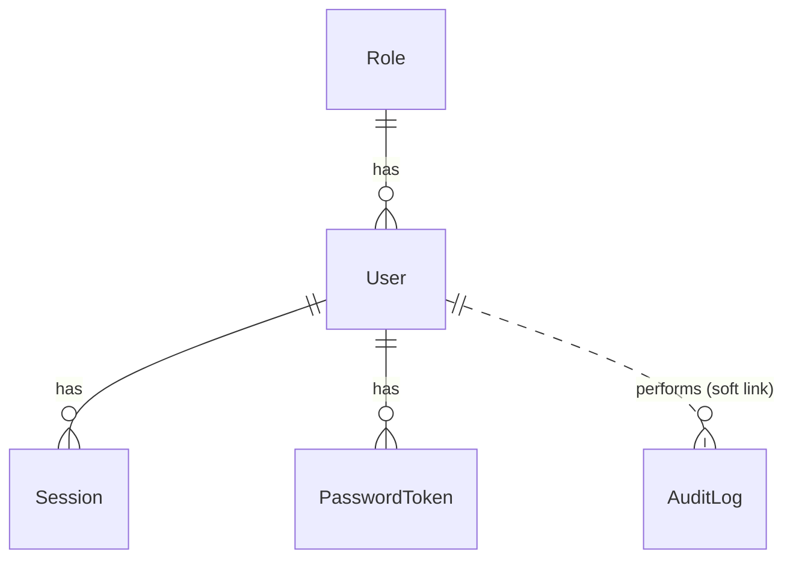
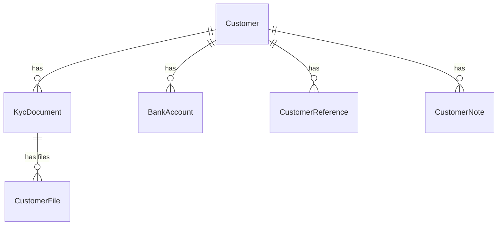
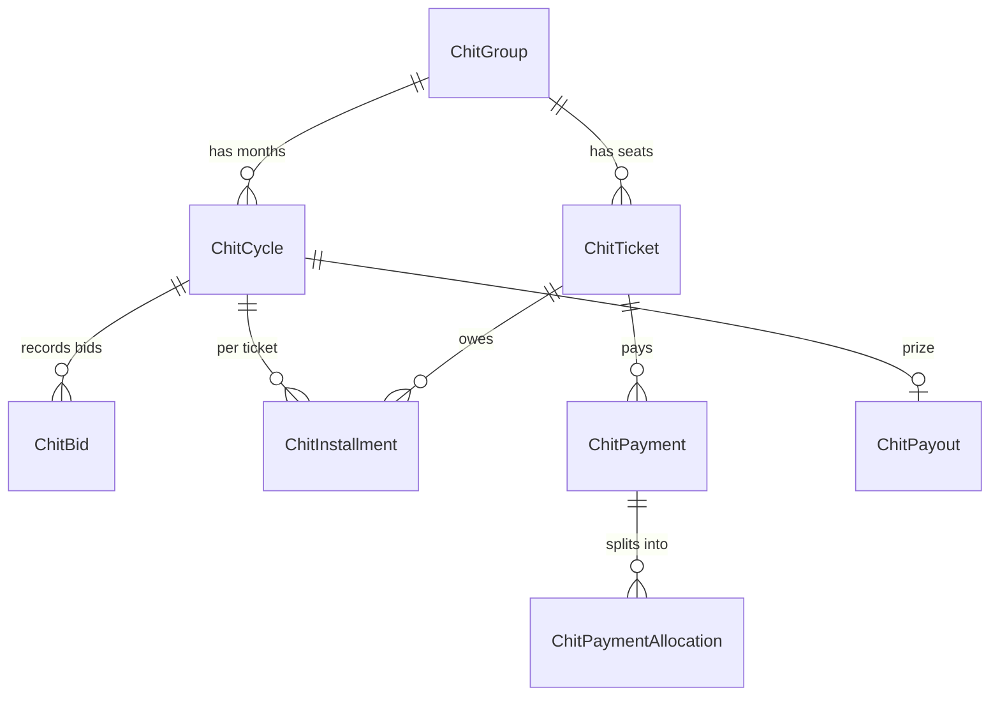

# Data Model

Foundation and Customers/KYC. Later phases add loans, chits, ledger, etc. See `apps/api/prisma/schema.prisma` for the source of truth.

| Table           | Purpose                                                  | Notes                                                                                                                                                                          |
| --------------- | -------------------------------------------------------- | ------------------------------------------------------------------------------------------------------------------------------------------------------------------------------ |
| `Role`          | Named set of `module:action` permissions plus data scope | `locked` = Super Admin (uneditable, unassignable). `system` roles cannot be deleted. `permissions` is a text array validated against the shared catalog.                       |
| `User`          | Staff account                                            | Email stored lower-case. `mustChangePassword`, lockout (`failedLogins`, `lockedUntil`), encrypted TOTP secret. Soft delete via `deletedAt`.                                    |
| `Session`       | One row per refresh token                                | Only the SHA-256 hash is stored. Rotating: each refresh revokes the row (`rotated`) and creates a child in the same `familyId`. Replaying a rotated token revokes the family.  |
| `PasswordToken` | Single-use invite / reset link                           | Hash only. Invite valid 72h, reset 2h.                                                                                                                                         |
| `AuditLog`      | Who did what, when, from where, before/after             | Append-only: DB triggers reject UPDATE, DELETE and TRUNCATE. Secrets are redacted before writing. `userId` is deliberately not a foreign key so history survives user changes. |

## Conventions

- IDs: UUIDv7 (`uuid(7)`), human-readable codes added per entity later (e.g. `CUS1007`).
- Money (later phases): BIGINT paise. Timestamps: UTC.
- Business entities are soft-deleted; hard delete only via an explicit audited purge (later).
- Multi-step writes and their audit rows commit in one DB transaction.

## Customers and KYC

| Table               | Purpose                                 | Notes                                                                                                                                                                                                                                                                                                                                                         |
| ------------------- | --------------------------------------- | ------------------------------------------------------------------------------------------------------------------------------------------------------------------------------------------------------------------------------------------------------------------------------------------------------------------------------------------------------------- |
| `Customer`          | The person and their registration state | `code` from sequence `customer_code_seq` (CUS1000...). `status` DRAFT / ACTIVE / INACTIVE; drafts are partially saved wizard records. `completedSteps`, `kycStatus`, `riskLevel`, `category`, `dtiBp` are derived and recomputed on every change. Money is BIGINT paise. `watchStatus` NONE / WATCHLIST / BLACKLIST with reason. Soft delete via `deletedAt`. |
| `KycDocument`       | One row per customer per document type  | Number stored as AES-256-GCM ciphertext (`numberEnc`) plus `numberLast4`, `numberLength` for masking and `numberHash` (HMAC blind index) for duplicate detection and exact search. Status PENDING / VERIFIED / REJECTED / EXPIRED. Changing a number or uploading new evidence resets it to PENDING.                                                          |
| `CustomerFile`      | Uploaded image or PDF                   | Stored on disk by `storageKey`; type sniffed from bytes; SHA-256 recorded. Never served publicly.                                                                                                                                                                                                                                                             |
| `BankAccount`       | Payout account                          | Account number encrypted, same masking and blind-index scheme.                                                                                                                                                                                                                                                                                                |
| `CustomerReference` | References (1 to 5)                     |                                                                                                                                                                                                                                                                                                                                                               |
| `CustomerNote`      | Notes, call/visit logs, follow-up tasks | A note with `followUpOn` is a task until `completedAt` is set.                                                                                                                                                                                                                                                                                                |

Postgres extension `pg_trgm` powers fuzzy name matching (with date of birth) in duplicate detection.

## Ledger

| Table          | Purpose              | Notes                                                                                                                                                                                   |
| -------------- | -------------------- | --------------------------------------------------------------------------------------------------------------------------------------------------------------------------------------- |
| `Account`      | Chart of accounts    | Default codes: 1000 Cash, 1100 Bank, 2000 Chit subscribers' payable, 3000 Capital, 4000 Chit commission income, 4100 Penalty income, 4200 Fee income, 5000 Expenses. Created on demand. |
| `JournalEntry` | One balanced posting | `idempotencyKey` unique: the same key can never post twice. `reversesId` links a reversal to its original (unique: one reversal per entry).                                             |
| `JournalLine`  | Debit or credit line | Single-sided, non-negative paise (CHECK constraint). `dimension` carries the chit group id so a group ledger reads straight from the journal.                                           |

Database guarantees: UPDATE and DELETE on both tables are blocked by triggers, and a deferred constraint trigger refuses to commit any entry whose debits do not equal its credits. Corrections are new entries.

## Chit funds

| Table                          | Purpose                           | Notes                                                                                                                         |
| ------------------------------ | --------------------------------- | ----------------------------------------------------------------------------------------------------------------------------- |
| `ChitGroup`                    | Terms and status                  | Code `CHIT001...`. Value, subscription, commission and penalty stored as paise or basis points.                               |
| `ChitTicket`                   | One seat (1..members)             | `customerId` null while vacant. `prized` and `prizedMonth` enforce one prize per ticket. `advancePaise` is credit paid ahead. |
| `ChitCycle`                    | One month                         | Filled when the auction closes: winner, discount, commission, dividend per member, residue, prize, net installment.           |
| `ChitBid`                      | Every bid, in order               | Append-only (trigger). `seq` decides ties.                                                                                    |
| `ChitInstallment`              | What a ticket owes for a month    | `netDuePaise` is null until the auction closes (not yet payable).                                                             |
| `ChitPayment`                  | A receipt                         | `receiptNo` from a sequence. `idempotencyKey` unique. Status POSTED or REVERSED. Mode SET_OFF is used only for prize set-off. |
| `ChitPaymentAllocation`        | Where the money went              | INSTALLMENT, PENALTY, ADVANCE, or ADVANCE_APPLIED (advance consumed automatically at an auction).                             |
| `ChitPayout`                   | The winner's prize                | PENDING, APPROVED, PAID. Records set-off, net paid and the security check.                                                    |
| `ChitWaitlist`, `ChitTransfer` | Waiting list and ticket transfers |                                                                                                                               |

## Bulk import

| Table         | Purpose                               | Notes                                                                                                                                                                                                                                                                                                                                                                                                                                                               |
| ------------- | ------------------------------------- | ------------------------------------------------------------------------------------------------------------------------------------------------------------------------------------------------------------------------------------------------------------------------------------------------------------------------------------------------------------------------------------------------------------------------------------------------------------------- |
| `ImportBatch` | A checked spreadsheet awaiting import | `dataEnc` holds every row (including ID and bank numbers) as AES-256-GCM ciphertext. It is cleared when the batch is imported (keeping only rows not imported, so their "rows to fix" file stays available), discarded, or after 24 hours (`expiresAt`). Status VALIDATED, IMPORTING, IMPORTED, DISCARDED, EXPIRED. IMPORTING is a lock so a batch cannot be imported twice; a stuck lock is released after 15 minutes. `createdCodes` lists the customers created. |
